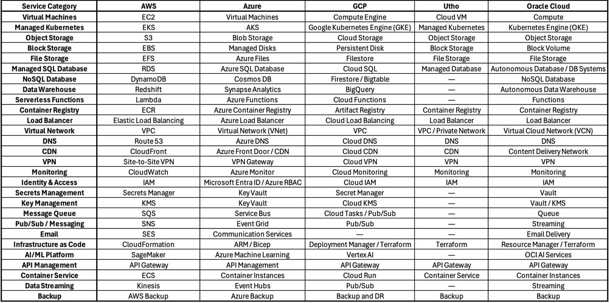

## DAY 7

 

 

AWS Class 1

7th AUG Friday  
LINK: [https://www.youtube.com/watch?v=izcuHI9P1wc](https://www.youtube.com/watch?v=izcuHI9P1wc)

 

>  
> 
> 7th SEPT: [https://www.youtube.com/watch?v=W2-5zDNPXZ0](https://www.youtube.com/watch?v=W2-5zDNPXZ0)
> 
>  
> 
>  
> 
>  
> 
>  
> 
> Comment:
> 
> - **Cloud vs. On-Premise:** Explored infrastructure differences, public vs. private network access (VPN/Private IPs), and multi-cloud providers (AWS, Azure, GCP).
> - **AWS Global Infrastructure:** Covered Regions, Availability Zones (AZs) for high availability, and multi-account management using Landing Zones and Control Towers.
> - **Core AWS Services:**
> - **EC2:** Mastered pricing models (On-Demand, Reserved, Spot), Auto-Scaling limits, AMIs, instance types, and security configurations.
> - **IAM & Security:** Clarified authentication vs. authorization, IAM policies (JSON structure), and ARNs.
> - **VPC & S3:** Learned VPC components (Internet vs. NAT gateways, public/private subnets, route tables) and S3 storage classes.
> 
>  
> 
> Missed evening class interviews

 

 

 

 

 

 

 

 

 

 

**Key topics covered** 

** 
**

** 
**

**On-Premise:** physical on-premise servers 

**vs.**

**Cloud Computing** using cloud-based infrastructure (3:14-4:34).

 

**We will choose on premise or cloud depending on requirement, budget, and privacy standards.**

 

**On premise : Local not connected to the open internet**

**Cloud : Connected to the open internet**

 

**On-premises vs cloud**

Both on premises and cloud both have hardware and are physically located somewhere.   
Both are equally scalable.

 

**Real diff.?**  

Cloud server can be reached by an open internet Public IP

 

For connecting to On premises server we need a preferred IP (A VPM connection has to be established)

Also your IP will change, It will go into the private IP range. 10. , 128. , 192. Class A B C

 

 

 

 

- **Cloud Service Providers:** 

There are different names for similar services in different clouds. AWS vs AZURE vs GCP

 

 

 

How do we determine which cloud to choose:

 

 

Always check region and account ID before any action/changes  

 

 

**AWS Infrastructure:** 

Concept of _Regions_ and _Availability Zones_ 

And their importance for high availability and disaster recovery (45:13-47:26).

 

Region > AZ (availability zone) 

 

Region: Mumbai AP South-1

AZ: Az1, Az2, Az3 

(The actual data sits here. Also we have the option to copy (Keep) the data in multiple Az for high availability (safety backup))

 

 

 

 

### AWS

### Landing zone and control tower.

For managing multi-account environments 

 

Usually different accounts are maintained for different services for redundancy (ensure high availability)

 

Control Tower > Landing Zone

 

 

 

 

 

 

 

### Detailed explanations of _AWS_ services like _EC2_, _IAM_, and _S3_.

EC2 discussion with their pricing model, instance types, auto scaling, AMI.

 

 

EC2 Flexible pricing models: 

On-demand, (expensive)

Reserved, (highly discounted, upfront payment for 1 year or 3 year)

Spot Instances, (used for RnD)

 

Auto Scaling for dynamic resource adjustment based on traffic.

Levels of auto-scaling:

Desired 

Minimum limit

Maximum limit

 

AMI (Amazon Machine Image):

Pre configured virtual machines

 

Instance type:

(t3.micro etc)

hardware on which our virtual machine will actually run

 

Misc. 

Key-pair : Is has to be creted to be able to login to our instance 

Auto-assign public IP: to be able to access our instance from internet

Security group: every application has a particular security group

 

 

 
**IAM role**  

**diff between authentication and authorisation** 

**concept of policies in AWS IAM.**

 

Authentication vs Authorization

who you are vs what can you do

 

 

Policies < Roles

2:07:00

2:39:30

 

 

Actual power lies with the policy 

“Effect”

“Action”

“Resource”

 

 

JSON file of a policy:-

 

 

Concept of Amazon Resource Name(ARN) and how it is used to identify a resource in aws.

ARN: It is a uniques identifier used to identify an AWS resource

 

 
**Virtual Private Cloud(VPC)** 

** 
**

Important interview question(on components of VPC):

NAT gateway v/s Internet gateway,

 

| Aspect | NAT Gateway | Internet Gateway |
| --- | --- | --- |
| Purpose | Lets private subnet resources reach the internet outbound | Lets public subnet resources communicate both ways with the internet |
| Direction | One-way, outbound only (private resources can't be reached from internet) | Two-way, inbound and outbound |
| Used by | Private subnets (DB servers, backend instances) | Public subnets (web servers, load balancers) |
| IP handling | Translates private IPs to a single NAT IP for outbound traffic | Maps public IP directly to the instance (1:1) |
| Placement | Sits in a public subnet, referenced by private subnet's route table | Attached directly to the VPC |
| Cost | Charged per hour + data processed | No additional charge (in most cloud providers like AWS) |
| Scalability | Managed, auto-scales (in AWS's managed NAT Gateway) | N/A, it's just a routing target, not a scaled resource |
| Security | Blocks unsolicited inbound connections by design | Doesn't filter traffic on its own, security groups/NACLs handle that |
| Example use case | App server in private subnet needs to download an OS patch | Web server in public subnet needs to be reachable by users |

The core distinction: 

NAT gateway is a one-way door for private resources going out, 

Internet gateway is the actual front door for anything public-facing.

 

Difference b/w public vs private subnet.

 

| Aspect | Public Subnet | Private Subnet |
| --- | --- | --- |
| Internet access | Direct, via Internet Gateway | No direct access, only outbound via NAT Gateway (if configured) |
| Reachable from internet | Yes, resources with public IPs can be accessed directly | No, resources aren't reachable from outside |
| Typical use case | Web servers, load balancers, bastion hosts | Databases, internal app servers, backend systems |
| IP assignment | Public IP or Elastic IP assigned | Only private IP, no public IP |
| Route table | Routes 0.0.0.0/0 to Internet Gateway | Routes 0.0.0.0/0 to NAT Gateway (or no internet route at all) |
| Security exposure | Higher, directly exposed to internet traffic | Lower, shielded behind the public layer |
| Example resource | Public-facing website, API gateway | RDS database, internal microservices |

Basically: 

public subnet is what the internet can see and touch directly, 

private subnet is what stays hidden behind it and only reaches out when it needs to (patches, updates), ~~never the other way around.~~

 

 

 

Route table of Private subnet has route to NAT Gateway

Route table of Public subnet has route to Internet Gateway

 

 

 

 

Migration vs Patching

CR: change request

 

 

 
**Simple Storage Service(s3)** 

 

 

 

Interview ques: Storage classes in S3

 

 

 

 

 

### **AWS old snippets**

 

 

IAAS 

Infrastructure -  hardware

 

 

PAAS 

Platform - hardware + OS

 

SAAS

Software - hardware + OS + software/applications

 

 

On premise - Not connected to the internet (being user internally)

Cloud - Connected to the network

 

 

 

 

On spot server 

(used for testing purposes)

Terminates on a notice of 2 minutes

 

 

 

 

AWS - EC2

AZURE - Virtual machine

GCP - Google compute engine

 

 

 

 

——

Not easy to build/scale

Vertical scaling = Same resource increase 

(Downtime possible)

 

Easy to scale

Horizontal scaling = Increasing the number of instances 

(No Downtime)

——

 

 

Account ID & Region

(Always remember the region where you have created the instance)

 

 

US East-1 is the cheapest service (TanMoyMoy)

t3.Micro (free forever)

 

KeyValue pair??

- Key: Represents the category or the name of the attribute (e.g., Environment or Owner).
- Value: Represents the specific data assigned to that key (e.g., Production or DevOpsTeam).

 

Instance naming convention for instance:

<Company name> <Region> <Appplication> <Team working upon> <Name>  

 

 

 

 

Class 1 : [https://www.youtube.com/watch?v=NoHNQtRpEog](https://www.youtube.com/watch?v=NoHNQtRpEog)

01:19:00 started creating the instance on AWS

 

01:42:00 1. EC2

01:43:00 2. IAM Identity and Access management

01:59:30 3. VPC (will be discussed tomorrow)

 

Will continue with S3 tomorrow

 

 

 

 

02:08:00

S3 has region specific name now??

Account regional namespace (new)

 

 

 

 

 

 

 

 

 

* * *

### Shubham Londhe crash course

# Learn AWS Billing, Monitoring & VPC in One Shot 

(covers subnet VPC and route-table subnet association)  
[https://youtu.be/KmNZo741hsg?si=8FbStIVKr5\_7wwHI&t=1777](https://youtu.be/KmNZo741hsg?si=8FbStIVKr5_7wwHI&t=1777)  
{

Creating EC-2 instance TEST-INSTANCE manually instead of selecting the default settings:-  
 -Created a test-public-subnet and test-vpc then launched our EC2 test-instance inside it 

Tried to connect using EC2 instance connect and failed because our test-public-subnet is still private  
(every created subnet is private by default, if internet gateway is connected it becomes public else remains private)

 

 
\-Go to internet gateway and create test-igw (internet gateway)

 

\-Then created a test-rt (route table) which will be created inside our test-vpc

 

\-Now goto route table>subnet association>edit associations>  tick test-public-subnet with click Save Associations

After this step out test-public-subnet is associated with our test-rt

 

Go back to subnets > edit and tick “Auto assigning public ipv4” > then click save

 

 

\-Still out internet gateway doesn’t know about our route table. Hence we goto test-igw and attach it to our test-vpc

\-Finally get back to route tables, select test-rt , click Routes> edit routes > Add a route (0.0.0.0/0) and also attach test-igw as target 

}

 

 

THIS IS HOW OUR CONNECTION FROM (LOCAL) TO (VPC) WORKS                                                

 

 

 

 

 

 

 

 

 

 

 

 